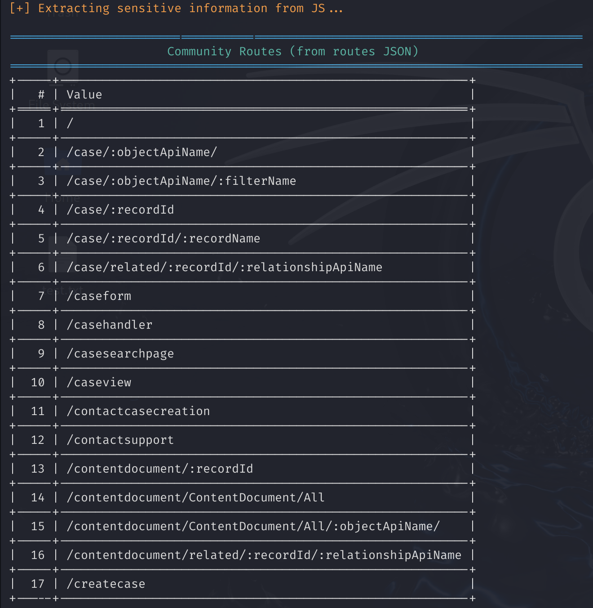

# Salesforce Community JS Recon

**A lightweight CLI tool to extract routes and sensitive patterns from Salesforce Experience Cloud JavaScript files.**

This utility is built for security testers, Salesforce admins, and developers to identify key application routes, internal references, and sensitive exposure in public-facing JS assets of Salesforce communities.

---

## 🚀 Features

- ✅ Automatically extracts community routes from embedded JSON inside JS files.
- ✅ Detects potential sensitive information like:
  - API Paths
  - Custom Objects
  - Secrets / Keys 
- ✅ Outputs community route patterns useful for bug bounty or pentesting investigations.

---

## 🛠️ Prerequisites

Make sure you have the following installed:

- Python 3.8+
- pip

📦 Installation

Clone the repository:

```bash
git clone https://github.com/hkramyy/salesforce-community-js-recon.git
cd salesforce-community-js-recon
```
Install dependencies:
```bash
pip install -r requirements.txt
```
⚙️ Usage
```bash
python sf_community_js_recon.py <target_community_url>
```
📌 Example
```bash
python sf_community_js_recon.py https://salesforce-js-recon.my.site.com/s/

or

python3 sf_community_js_recon.py https://salesforce-js-recon.my.site.com/s/
```
## 🔍 Output Example

Here's what the script output looks like:




